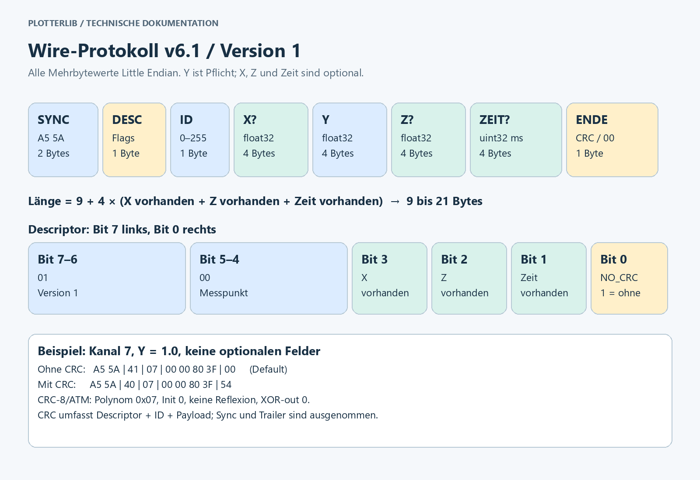

<p align="center">
  <a href="README.md"></a>
  <a href="README.de.md"></a>
</p>

<p align="center">
  <picture>
    <source media="(prefers-color-scheme: dark)" srcset="docs/images/kymotrace-logo-dark.svg">
    
  </picture>
</p>

<h3 align="center">KymoCore · Messwerte aus dem Mikrocontroller, live auf dem Bildschirm</h3>

<p align="center">
  Portable C++11-Telemetrie-Library für Arduino, ESP32 und STM32 – das Herzstück von <b>Kymotrace</b>.
</p>

<p align="center">
  
  
  
  
</p>

---

## Worum geht es?

Wer Sensoren auswertet, einen Regler einstellt oder einen Motor ansteuert, will
**sehen, was im Mikrocontroller gerade passiert**: sofort und nicht erst nach
dem Auslesen einer Logdatei. `Serial.print` stößt dabei schnell an Grenzen. Text
kostet Rechenzeit und Bandbreite, blockiert die Hauptschleife und muss auf dem
PC mühsam zerlegt werden.

**KymoCore** löst genau das. Die Library liest deine Messwerte im
eingestellten Takt, verpackt sie in kompakte Binärframes von **9 bis 21 Bytes**
und gibt sie an eine beliebige Schnittstelle weiter, ohne den Hauptzyklus
aufzuhalten. Auf dem PC zeigt [KymoStudio](https://github.com/CodeName-666/kymostudio)
die Signale live als Kurve, als XY-Bahn oder in 3D.

<p align="center">
  
  <br><sub>Live-Daten in KymoStudio: drei Signale im Zeitverlauf, zwei als XY-Bahn.</sub>
</p>

## Was KymoCore kann

| | |
|---|---|
| **Viele Kanäle, eigener Takt** | Bis zu 256 Kanäle, jeder mit eigenem Abtastintervall. Ein Round-Robin-Scheduler entscheidet, wer dran ist. |
| **Mehr als eine Zahl** | Y, XY oder XYZ pro Messpunkt, optional mit Zeitstempel und CRC-Prüfsumme. |
| **Kompakt auf der Leitung** | 9–21 Bytes pro Messpunkt, float32, Little Endian. Ein feststehendes, dokumentiertes [Protokoll](PROTOCOL.md). |
| **Blockiert nie** | Einmal `Kymo_Init()`, dann zyklisch `Kymo_Main()`. Läuft ohne RTOS, ohne Heap, ohne Exceptions und ohne RTTI. |
| **Jede Schnittstelle** | UART, USB-CDC, WLAN/TCP, MQTT, CAN …: Du lieferst einen `write`-Callback, KymoCore liefert die Bytes. |
| **Langsame Leitungen inklusive** | Teilübertragungen, Rückstau und ausgeliehene DMA-Puffer werden sauber behandelt. |
| **Nur was du brauchst** | X, Z, Zeitstempel, CRC, Decoder und C++-API lassen sich zur Compile-Zeit einzeln zuschalten. Standard ist minimal. |
| **C und C++** | C++11-Kern mit C-kompatibler API, auch aus C99-Projekten nutzbar. |

## Wofür man es einsetzt

- **Regelungstechnik:** Soll-, Ist- und Stellgröße eines PID-Reglers live vergleichen und die Parameter einstellen.
- **Sensorentwicklung:** Rauschen, Drift und Sprungantwort von Sensoren sichtbar machen.
- **Motoren und Leistungselektronik:** Ströme, Drehzahlen und Positionen mit Zeitstempel aufzeichnen.
- **Prüfstände und Dauerläufe:** viele Kanäle parallel überwachen, per CRC gegen Übertragungsfehler gesichert.
- **Robotik und Bewegung:** Bahnen und Trajektorien direkt als XY- oder XYZ-Kurve darstellen.
- **Lehre, Studium und Maker-Projekte:** Messdaten verständlich machen, statt Zahlenkolonnen im seriellen Monitor zu lesen.

## So funktioniert es


1. **Deine Anwendung** stellt Uhr und Messfunktion bereit und legt fest, welche Kanäle wie oft gemessen werden.
2. **KymoCore** entscheidet, welcher Kanal fällig ist, ruft deine Messfunktion auf und kodiert den Frame.
3. **Dein Transport** (UART, USB, TCP, MQTT …) nimmt die Bytes entgegen, auch stückweise.
4. **KymoStudio** setzt den Datenstrom wieder zusammen, prüft ihn und zeichnet die Kurven.

Die Library enthält bewusst **keine Hardwaretreiber**. Sie bleibt dadurch auf
jeder Plattform gleich, vom Arduino Uno bis zum STM32 mit DMA.

## Schnellstart

In der `platformio.ini` deines Projekts eintragen:

```ini
lib_deps =
    codename666/KymoCore @ 6.2.3
```

### Vollständiges Beispiel für Arduino und ESP32

Folgender Inhalt für `src/main.cpp` sendet auf Kanal 0 alle 20 ms einen
synthetischen Sägezahn zwischen 0 und knapp 1. Er verwendet ausschließlich
die Standardeinstellungen. Die serielle Schnittstelle bleibt für Binärdaten
reserviert; Diagnoseausgaben würden denselben Datenstrom verändern.

```cpp
#include <Arduino.h>
#include <kymo_runtime.h>

static KymoContext context = {};
static KymoStatus lastStatus = KYMO_BAD_CONFIG;
static uint32_t lastSampleMs[1] = {};
static const KymoChannel channels[] = {{20U, 0U, 0U}};

/*******************************************************************************
 * readClockMs
 ******************************************************************************/
static uint32_t readClockMs(void *user)
{
    uint32_t result = static_cast<uint32_t>(millis());
    (void)user;
    return result;
}

/*******************************************************************************
 * readSample
 ******************************************************************************/
static uint8_t readSample(void *user, uint8_t id, KymoSample *out)
{
    uint8_t result = 0U;
    (void)user;
    (void)id;
    if (out != nullptr) {
        out->value = static_cast<float>(millis() % 1000UL) / 1000.0f;
        result = 1U;
    }
    return result;
}

/*******************************************************************************
 * writeBytes
 ******************************************************************************/
static uint8_t writeBytes(void *user, const uint8_t *bytes, uint8_t length)
{
    uint8_t result = 0U;
    int available = Serial.availableForWrite();
    (void)user;
    if ((bytes != nullptr) && (available > 0)) {
        if (available < length) {
            length = static_cast<uint8_t>(available);
        }
        result = static_cast<uint8_t>(Serial.write(bytes, length));
    }
    return result;
}

static const KymoConfig config = {
    channels, lastSampleMs, readClockMs, nullptr, readSample, nullptr,
    writeBytes, nullptr, nullptr, nullptr, 1U
};

/*******************************************************************************
 * setup
 ******************************************************************************/
void setup()
{
    Serial.begin(115200);
    lastStatus = Kymo_Init(&context, &config);
}

/*******************************************************************************
 * loop
 ******************************************************************************/
void loop()
{
    if ((lastStatus != KYMO_BAD_CONFIG) && (lastStatus != KYMO_IO_ERROR)) {
        lastStatus = Kymo_Main(&context);
    }
}
```

`int available` folgt dem Rückgabetyp der Arduino-API; vor der Verengung wird
der Wertebereich geprüft. Serial kopiert die angenommenen Bytes; deshalb ist
hier kein Busy-Callback nötig. Die tatsächliche Ausführungszeit hängt vom
Serial-Treiber ab. Den Messcallback später durch den Sensorzugriff ersetzen.

Mit `pio run` bauen, anschließend mit `pio run -t upload` auf das angeschlossene
Board übertragen. KymoStudio mit 115200 Baud und 8N1 verbinden und Kanal 0
einem Diagramm zuordnen. Einen geöffneten seriellen Monitor vorher schließen.
Ein vollständig SDK-freies, ausführbares Beispiel liegt in
[examples/basic](examples/basic/README.md).

## Unterstützte Plattformen

KymoCore ist plattformunabhängig. Mit den Beispielen aus
[kymoprobe](https://github.com/CodeName-666/kymoprobe) sind diese Ziele gebaut und geprüft:

| Familie | Boards | Transport im Beispiel |
|---|---|---|
| Arduino AVR | Uno, Nano, Mega | UART |
| ESP32 | ESP32, ESP32-S3, ESP32-C3 | UART, WLAN/MQTT |
| STM32 | Nucleo F401RE, F411RE, Blue Pill F103C8 | UART, USB-CDC |
| PC (nativ) | GCC/Clang | Testprogramme |

## Das Protokoll auf einen Blick



Die vollständige Spezifikation mit Beispielframes steht in [PROTOCOL.md](PROTOCOL.md).

## Teil von Kymotrace

| Projekt | Rolle |
|---|---|
| **[KymoCore](https://github.com/CodeName-666/kymocore)** | diese Library: Messwerte erfassen und senden |
| [KymoProbe](https://github.com/CodeName-666/kymoprobe) | Firmware und Hardwarebeispiele für ESP32, Arduino und STM32 |
| [KymoStudio](https://github.com/CodeName-666/kymostudio) | Desktop-App: empfangen, darstellen, analysieren, exportieren |

## Dokumentation

- **[Anleitung und API-Referenz](docs/GUIDE.de.md):** Konfiguration, Scheduling, Transporte und Dimensionierung
- **[Protokoll](PROTOCOL.md):** Byte-Aufbau, CRC, Beispielframes
- **[Portables Beispiel](examples/basic/README.md):** ohne Hardware auf dem PC ausführbar
- **[Änderungen](CHANGELOG.md)** · **[Veröffentlichung](PUBLISHING.md)** · **[Mitmachen](CONTRIBUTING.de.md)**

## Lizenz

Copyright (c) 2026 Christof Seidel. KymoCore ist doppelt lizenziert:

- **GPLv3** ([LICENSE](LICENSE)) ist kostenlos, etwa für Hobby, Basteln,
  Lernen und Open-Source-Projekte.
- Eine **kommerzielle Lizenz** braucht, wer Firmware oder Geräte mit KymoCore
  weitergibt, ohne den eigenen Quellcode unter der GPLv3 offenzulegen.

Details und Kontakt stehen in [COMMERCIAL.md](COMMERCIAL.de.md). Versionen bis
einschließlich 6.1.0 stehen weiterhin unter der MIT-Lizenz.
