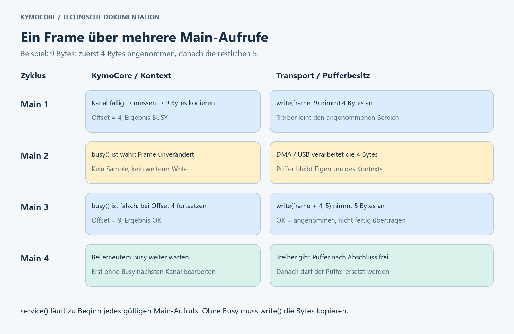

# KymoCore – Guide and reference

[← Back to overview](../README.md) · **English** · [Deutsch](GUIDE.de.md)

This guide explains setup, data path and protocol. The technical API reference
at the end describes the detailed contracts.

## Architecture and data path


The application owns the measurement sources, clock, configuration and
transport drivers. `Kymo_Init` validates the static configuration and binds it
to a context. `Kymo_Main` selects a due channel, calls the measurement
callback, encodes the data point and offers the bytes to the transport.
KymoStudio reassembles received fragments and assigns measurements by their
channel ID.

| Layer | Task | Interface |
|---|---|---|
| Application | Sensors, hardware initialisation and connection | Your own drivers |
| Time source | Provide monotonic milliseconds | `clock_ms(user)` |
| Measurement source | Read Y and, if needed, X/Z | `sample(user, id, out)` |
| Scheduler | Due times, round robin and backpressure | `Kymo_Init`, `Kymo_Main` |
| Codec | Check values and build a little-endian frame | `kymo_encode_data` |
| Transport adapter | Copy bytes or borrow them in a controlled way | `write`, optional `busy`/`service` |
| KymoStudio | Decode, display and analyse signals | [Desktop project](https://github.com/CodeName-666/kymostudio) |

The optional C++ class `Kymo` is an alternative push sender: the application
decides when to send. Both APIs use the same wire format. There is no
measurement queue in the core.

## Installing with PlatformIO

After publication, replace `PIO_OWNER` with the actual PlatformIO user or
organisation. The GitHub name does not determine this namespace automatically.
`PIO_OWNER` is explicitly a placeholder:

```ini
[env:esp32dev]
platform = espressif32@6.12.0
board = esp32dev
framework = arduino
monitor_speed = 115200
lib_deps =
    PIO_OWNER/KymoCore @ 6.2.2
```

For Uno, set `platform = atmelavr@5.3.0` and `board = uno` instead. The library
itself is tied neither to these boards nor to Arduino.

Until it is published in the registry, install directly from GitHub. The tag
pins the version:

```ini
lib_deps =
    https://github.com/CodeName-666/kymocore.git#v6.2.2
```

Alternatively, build a package from this repository:

```sh
pio pkg pack . -o KymoCore-6.2.2.tar.gz
```

Copy the archive into your project and reference it there:

```ini
lib_deps =
    file://KymoCore-6.2.2.tar.gz
```

Alternatively, copy the complete library folder to `lib/KymoCore` of your own
project.

## Complete Arduino and ESP32 example

The following content for `src/main.cpp` sends a synthetic sawtooth between 0
and just below 1 on channel 0 every 20 ms. It uses only the default settings.
The serial interface is reserved for binary data; diagnostic output would
corrupt the same data stream.

```cpp
#include <Arduino.h>
#include <kymo_runtime.h>

static KymoContext context = {};
static KymoStatus lastStatus = KYMO_BAD_CONFIG;
static uint32_t lastSampleMs[1] = {};
static const KymoChannel channels[] = {{20U, 0U, 0U}};

/*******************************************************************************
 * readClockMs
 ******************************************************************************/
static uint32_t readClockMs(void *user)
{
    uint32_t result = static_cast<uint32_t>(millis());
    (void)user;
    return result;
}

/*******************************************************************************
 * readSample
 ******************************************************************************/
static uint8_t readSample(void *user, uint8_t id, KymoSample *out)
{
    uint8_t result = 0U;
    (void)user;
    (void)id;
    if (out != nullptr) {
        out->value = static_cast<float>(millis() % 1000UL) / 1000.0f;
        result = 1U;
    }
    return result;
}

/*******************************************************************************
 * writeBytes
 ******************************************************************************/
static uint8_t writeBytes(void *user, const uint8_t *bytes, uint8_t length)
{
    uint8_t result = 0U;
    int available = Serial.availableForWrite();
    (void)user;
    if ((bytes != nullptr) && (available > 0)) {
        if (available < length) {
            length = static_cast<uint8_t>(available);
        }
        result = static_cast<uint8_t>(Serial.write(bytes, length));
    }
    return result;
}

static const KymoConfig config = {
    channels, lastSampleMs, readClockMs, nullptr, readSample, nullptr,
    writeBytes, nullptr, nullptr, nullptr, 1U
};

/*******************************************************************************
 * setup
 ******************************************************************************/
void setup()
{
    Serial.begin(115200);
    lastStatus = Kymo_Init(&context, &config);
}

/*******************************************************************************
 * loop
 ******************************************************************************/
void loop()
{
    if ((lastStatus != KYMO_BAD_CONFIG) && (lastStatus != KYMO_IO_ERROR)) {
        lastStatus = Kymo_Main(&context);
    }
}
```

`int available` follows the return type of the Arduino API; the value range is
checked before narrowing. Serial copies the accepted bytes, so no busy callback
is needed here. The actual execution time depends on the Serial driver. Later,
replace the measurement callback with your sensor access.

Build with `pio run`, then flash the connected board with `pio run -t upload`.
Connect KymoStudio at 115200 baud and 8N1 and assign channel 0 to a chart.
Close any open serial monitor first. A completely SDK-free, executable example
is in [examples/basic](../examples/basic/README.md).

## Features and configuration

The defaults result in a scalar Y sender with Init/Main. For installed registry
packages, project-wide `build_flags` are the reproducible choice: direct
changes in the installed package may be overwritten by updates. With source
copies, defaults can be edited in `src/kymo_build_config.h`. `kymo_features.h`
validates them. Compiler definitions take precedence.

| Switch | Default | Effect when 1 |
|---|---:|---|
| `KYMO_ENABLE_RUNTIME` | 1 | Init/Main scheduler |
| `KYMO_ENABLE_X` | 0 | Optional X coordinate |
| `KYMO_ENABLE_Z` | 0 | Optional Z coordinate, independent of X |
| `KYMO_ENABLE_TIMESTAMP` | 0 | Timestamp on the wire |
| `KYMO_ENABLE_CRC` | 0 | Compute outgoing CRC |
| `KYMO_ENABLE_DECODER` | 0 | Decode complete frames on the MCU |
| `KYMO_ENABLE_CPP` | 0 | C++ push sender and stream abstraction |

For XYZ with timestamp and CRC, add:

```ini
build_flags =
    -DKYMO_ENABLE_X=1
    -DKYMO_ENABLE_Z=1
    -DKYMO_ENABLE_TIMESTAMP=1
    -DKYMO_ENABLE_CRC=1
```

Enabling a feature allows a field; each channel's flags select it for that
channel's frame. XYZ with timestamp uses `KYMO_ALLOWED_FLAGS`, timestamp only
`KYMO_FLAG_TIMESTAMP`. The callback sets X/Z; the runtime computes the time
since Init. Rebuild all units together: a define in the sketch alone does not
configure separately compiled library files.

Only 0 and 1 are allowed. Disabled implementations are compiled out. Invalid
field requests are rejected, not silently dropped. Public data layouts stay the
same; the switches mainly save code. The MCU decoder checks protected input
even when outgoing CRC is disabled. The desktop decoder is independent of
firmware features.

## Scheduling and transmission flow



1–256 unique channel IDs are possible. Periods range from 0 to `INT32_MAX` ms;
0 means on every possible selection. After Init all channels are due
immediately. Main checks at most N channels and calls the measurement callback
at most once and Write at most once. Round robin prevents permanent
starvation. Call Main more often than the sum of the desired sampling rates;
short writes need further calls.

Each context has **one 21-byte TX buffer**, plus further context fields and
**4 bytes of scheduling state per channel**. The whole context is larger than
21 bytes and ABI-dependent. Configuration, stack and driver buffers come on
top. A pending frame keeps its measurement. Afterwards current values are
requested; missed samples are not reconstructed.

`write(user, bytes, length)` reports the number of accepted bytes. Zero means
try again later; a short write advances the offset. The next Main call
continues with the rest. A return value greater than the requested length
latches `KYMO_IO_ERROR` until a safe re-initialisation.

With synchronous transmission, the callback must copy or consume accepted bytes
before returning. With DMA/USB the driver may keep the pointer if `busy(user)`
stays non-zero until release. Meanwhile the buffer is not overwritten.
`KYMO_OK` means acceptance by the driver, not physical completion or a receipt.
`service(user)` runs at the start of every valid Main call, even when busy and
with a latched error.

All configuration data must outlive its use. Each instance owns its own context
and its own timestamp array. The APIs are not reentrant; the application takes
care of task/ISR synchronisation. Do not re-initialise or destroy while a
driver borrows the buffer. During partial frames, other producers must not mix
bytes into the same stream.

## Protocol and byte layout


Package version 6.2.2, protocol v6.1 and **wire version 1** are different
things. The normative contract is in [PROTOCOL.md](../PROTOCOL.md).

| Offset | Size | Content |
|---|---:|---|
| 0 | 1 byte | Sync `A5` |
| 1 | 1 byte | Sync `5A` |
| 2 | 1 byte | Descriptor |
| 3 | 1 byte | Channel ID 0–255 |
| 4 | 0/4 bytes | Optional X |
| 4 or 8 | 4 bytes | Y, always present |
| after Y | 0/4 bytes | Optional Z |
| after Z or Y | 0/4 bytes | Optional time in ms |
| last byte | 1 byte | CRC-8/ATM or zero trailer |

The payload order is **X? → Y → Z? → time?**. X/Y/Z are finite IEEE-754
float32 values; NaN and infinity are rejected. Time is an unsigned 32-bit
millisecond value relative to sender start and wraps after about 49.7 days.
Multi-byte values are little endian: least significant byte first. No packed
C structures are transmitted directly.

| Descriptor bits | Meaning |
|---|---|
| 7–6 | `01` = wire version 1 |
| 5–4 | `00` = data point |
| 3 | X present |
| 2 | Z present |
| 1 | Timestamp present |
| 0 | `NO_CRC`: 1 without CRC, 0 with CRC |

`0x40` to `0x4F` are valid: even values with CRC, odd values without CRC.
Other versions and message types are rejected. Firmware features can restrict
the supported layouts further.

**Length = 9 + 4 × (X present + Z present + time present)**, where each term is
0 or 1. A separate length byte is not needed.

| Layout | Without time | With time |
|---|---:|---:|
| Y | 9 bytes | 13 bytes |
| XY | 13 bytes | 17 bytes |
| YZ | 13 bytes | 17 bytes |
| XYZ | 17 bytes | 21 bytes |

### Concrete frames

Channel 7, Y = 1.0, without time and without CRC:

```text
A5 5A | 41 | 07 | 00 00 80 3F | 00
Sync    Desc ID   Y = 1.0        Trailer
```

`0x41 = 01000001`: version 1, data point, no optional fields, NO_CRC set.
`00 00 80 3F` is little endian for float32 `0x3F800000`. With CRC the frame is
`A5 5A 40 07 00 00 80 3F 54`.

Channel 3, X = 1.25, Y = −2.5, Z = 9.0, time = 1234 ms:

```text
A5 5A | 4F | 03 | 00 00 A0 3F | 00 00 20 C0 | 00 00 10 41 | D2 04 00 00 | 00
Sync    Desc ID   X = 1.25      Y = -2.5      Z = 9.0       time = 1234   Trailer
```

The full frame has 21 bytes. With CRC, `4F` becomes `4E` and the last byte
becomes `89`. The app's Python data points represent the wire milliseconds as
seconds: 1234 ms correspond to 1.234 s.

### CRC and resynchronisation

CRC is disabled by default. The sender sets NO_CRC and writes a zero trailer
byte. The receiver ignores its value. Sync, descriptor, length and finiteness
checks stay active but do not detect every corruption: a corrupted finite
measurement can get through.

With `KYMO_ENABLE_CRC=1`, CRC-8/ATM applies: polynomial `0x07`, initial value
`0x00`, no reflection, XOR-out `0x00`. **Descriptor, ID and payload** are
protected; sync and the CRC byte itself are excluded. ASCII `123456789` yields
`F4`. After invalid frames, the desktop stream decoder searches for `A5 5A`
again. Transport read boundaries are not frame boundaries.

Older v6.0 receivers do not accept NO_CRC. Therefore use an updated app or
enable CRC. The current desktop decoder handles both modes, even mixed. The
optional MCU decoder expects a complete frame; it is not a stream assembler.

## Transports and sizing

| Transport | Connection by the application | Framing |
|---|---|---|
| UART / Serial | Copying write or DMA plus busy | Partial frames possible |
| USB CDC | Copy or borrow the buffer plus busy | USB packets are not frame boundaries |
| TCP | Socket write, optional service | Continuous byte stream |
| MQTT | Network service and publish callback | Accept the whole frame or report 0 |
| CAN FD | Embed the whole frame in the data field | Remove padding before decoding |
| Classic CAN | Own compact mapping | No 9–21 byte frame in an 8-byte packet |

Classic CAN uses a channel mapping via arbitration ID or adapter configuration
and a configured number format. Details are in the
[protocol contract](../PROTOCOL.md#can). Network setup and reconnection belong
to the adapter. The external PubSubClient example connects synchronously and is
therefore no proof of a hard real-time cycle.

UART at 115200 baud and 8N1 needs ten line bits per byte. In theory 11,520
bytes/s are possible: about 1,280 Y data points/s or 548 XYZ data points/s with
timestamp, each without further gaps or driver overhead. Ten channels at 100 Hz
each need 9,000 bytes/s as plain Y frames; with timestamp 13,000 bytes/s, more
than this UART can carry. Size the measurement rate, Main call frequency and
transport together.

## Connecting KymoStudio

The matching desktop application is
**[KymoStudio on GitHub](https://github.com/CodeName-666/kymostudio)**. It hosts
the source code and information on the current project state. The library
delivers telemetry; the app handles reception and visualisation.

1. Use an app decoder with v6.1/NO_CRC support or enable firmware CRC. Your
   local development state and the public repository may differ.
2. Flash the firmware and configure the input in the app, for example Serial at
   115200 baud/8N1 or MQTT with the publisher's topic.
3. Assign the channel ID to a signal/chart. Y is the measurement; X/Z are
   optional coordinates. Without X, no measured X value is transmitted.
4. First check the known example waveform, then connect sensors.

The protocol does not transmit channel names, units or sensor configurations.
This mapping stays with the application and the app. A back channel for
control commands is not part of v6.1. The app can additionally receive legacy
JSON; KymoCore encodes binary.

## Package structure and checks

```text
KymoCore/
  library.json             PlatformIO metadata and export scope
  library.properties       Arduino metadata
  LICENSE                  GPLv3 license text
  COMMERCIAL.md            Dual licensing: GPLv3 or commercial
  CONTRIBUTING.md          Contributions and grant of rights
  README.md                Overview and quick start
  PROTOCOL.md              Normative wire contract
  CHANGELOG.md             Changes and migration
  PUBLISHING.md            Release preparation for maintainers
  src/                     Platform-independent core and headers
    common/                Bit, byte and CRC helpers
  examples/basic/          SDK-free executable example
  docs/                    Guide (English/German) and images
```

This repository's CI compiles and runs the portable example and the golden
vector test (with and without CRC) on every push. The full tests run in the
firmware [kymoprobe](https://github.com/CodeName-666/kymoprobe): feature
profiles, the real app decoder, package and board builds. There this library is
included as the Git submodule `lib/KymoCore`:

```sh
python tools/test_native.py --app ../KymoStudio
python tools/test_package.py
```

The package check builds separate consumers from the archive and compiles the
Arduino example of the README. Among other things, the native tests check
feature profiles, CRC, scheduling and the real app decoder. Builds do not
replace board tests, stack measurements or timing measurements in the driver.
Validate your own adapters on the target hardware. Package preparation and the
remaining steps are in [PUBLISHING.md](../PUBLISHING.md) (German), changes in
[CHANGELOG.md](../CHANGELOG.md).

## Technical API reference

The following reference specifies compiler, configuration and ownership contracts.

The recommended API is `kymo_runtime.h`. The entire implementation is built
as C++11 or newer, without heap allocation, exceptions or RTTI.
`kymo_protocol.h` exposes the standalone codec; `kymo.h` offers an optional
C++11 push sender. The codec and Init/Main headers retain C linkage, so existing
C99 applications and callbacks can still use the library.
Compile `kymo_runtime.cpp` / `kymo_protocol.cpp` with a C++11 compiler and
link mixed C/C++ applications with the C++ toolchain. PlatformIO sets the library
flags automatically; custom builds should use
`-std=c++11 -fno-exceptions -fno-rtti`. Arduino builds must provide C++11 or newer.
PlatformIO's framework/platform compatibility is unrestricted.

## Minimal build and optional features

The default build contains scalar Y encoding and the C++11 Init/Main runtime.
Optional implementations are excluded by the preprocessor, not merely disabled
at runtime. Edit the `KYMO_ENABLE_*` values directly in
**`src/kymo_build_config.h`**: `0` disables a feature, `1` enables it.
This header is included automatically by all library and application APIs;
no PlatformIO setting or sketch-local define is required. `kymo_features.h`
loads the configuration and checks the values.

| Build switch | Default | Enables |
| --- | --- | --- |
| `KYMO_ENABLE_RUNTIME` | `1` | Cooperative scheduling through Init/Main |
| `KYMO_ENABLE_X` | `0` | X coordinates / XY data |
| `KYMO_ENABLE_Z` | `0` | Z coordinates / YZ data, independently of X |
| `KYMO_ENABLE_TIMESTAMP` | `0` | Wire timestamps; scheduling still uses a clock |
| `KYMO_ENABLE_CRC` | `0` | CRC on outgoing frames |
| `KYMO_ENABLE_DECODER` | `0` | MCU decoding, including CRC verification |
| `KYMO_ENABLE_CPP` | `0` | Optional C++ push sender and stream abstraction |

Only `0` and `1` are accepted. Rebuild the entire library and application after
editing the header. No switch depends on the MCU.

Compiler definitions remain optional **overrides**: `-DKYMO_ENABLE_X=1`
takes precedence over the internal header through its `#ifndef` guards.
Apply overrides to **all library and application compilation units**. A define
in a sketch alone does not configure separately compiled library sources.
Remove matching `build_flags` entries when the internal header should control
those features; supplied examples explicitly override their required options.

For example, optional PlatformIO overrides for a timestamped XYZ sender with CRC:

```ini
build_flags =
    -DKYMO_ENABLE_X=1
    -DKYMO_ENABLE_Z=1
    -DKYMO_ENABLE_TIMESTAMP=1
    -DKYMO_ENABLE_CRC=1
```

Set `KYMO_ENABLE_RUNTIME=0` for an encoder-only build. For a C++ push sender
without the scheduler, also set `KYMO_ENABLE_CPP=1`. Decoder and C++/runtime
entrypoints are unavailable when their module is disabled. CRC code is absent
unless either outgoing CRC or MCU decoding is enabled. The enabled MCU decoder
still verifies protected legacy input even when outgoing CRC is disabled.

Disabled X/Z/time flags return zero from encoding, `KYMO_BAD_CONFIG` from
Init, and failure from decoding. C++ requests for disabled fields return false.
Fields are never silently removed. `KYMO_ALLOWED_FLAGS` describes the wire
protocol; `KYMO_SUPPORTED_FLAGS` describes this build. KymoStudio continues
to accept all wire layouts independently of firmware feature selection.

Buffer bounds, finite-value checks, short-write handling and asynchronous buffer
ownership remain mandatory. Public structures and the maximum 21-byte buffer
stay unchanged: these switches primarily reduce code, not allocated context RAM.
Unused modules may already be eliminated by a linker with section garbage
collection/LTO; feature switches also remove optional branches within used code.

## Static configuration

Define this in your application's `kymo_config.c` (or `.cpp`):

```c
#include <kymo_runtime.h>

static uint32_t clock_ms(void *user); /* your monotonic millisecond clock */
static uint8_t read_sample(void *user, uint8_t id, KymoSample *out);
static uint8_t write_bytes(void *user, const uint8_t *bytes, uint8_t length);

static const KymoChannel channels[] = {
    {20, 0, 0},
    {100, 1, 0}
};
static uint32_t last_sample_ms[2];
const KymoConfig kymo_config = {
    channels, last_sample_ms, clock_ms, 0, read_sample, 0,
    write_bytes, 0, 0, 0, 2
};
```

Implement the three callbacks in that file. `read_sample` assigns `out->value`
and optional `out->x` / `out->z`; returning zero skips a measurement until its
next scheduled interval. It can read shared application parameters through
`sample_user`. The runtime zero-initializes all sample fields before calling it.
Hardware handles belong in `transport_user`; clocks can use `clock_user`.

Initialize hardware first, then call:

```c
static KymoContext kymo;
if (Kymo_Init(&kymo, &kymo_config) != KYMO_OK) {
    /* handle invalid configuration */
}
/* From your existing cyclic task: */
KymoStatus status = Kymo_Main(&kymo);
```

Config, channels and last_sample_ms must remain alive. Do not mutate config or
channels after Init. Every instance needs its own context and last_sample_ms
array. Hardware setup remains the application's responsibility. Configuration
is compiled data, not a runtime file requiring a filesystem/parser.

## Scheduling and memory

- 1–256 unique channel IDs; IDs, flags, status, TX lengths and offsets are bytes.
- Periods are uint32 milliseconds, limited to INT32_MAX; zero means every
  eligible Main invocation. First samples are due immediately.
- One fixed **21-byte TX buffer** per context and **4 bytes runtime state per
  channel**. Config is separate and immutable. No measurement queue or heap.
- At most one sample callback and one transport write per Main; at most N
  channel checks. Round-robin selection avoids starvation. Call Main faster
  than the sum of configured sample rates; short writes need additional calls.
- Slow transports apply backpressure. A pending frame retains its original
  value/timestamp; after it finishes, overdue channels sample current values.
  There is no attempt to replay missed samples or an unbounded catch-up burst.
- uint32 subtraction handles clock rollover. Invoke Main at least once within
  INT32_MAX ms. Wire timestamps wrap after approximately 49.7 days, per v6.
- All entrypoints are single-task/non-reentrant. Synchronize application values
  shared with interrupts. Do not reinitialize while DMA/USB borrows a buffer.
- Native pointer/numeric structs remain naturally aligned. Explicit byte
  encoding avoids packed structs, enum-width and endian dependencies. IEEE-754
  binary32 floats are required; do not enable finite-math-only/fast-math modes.

## Transport callbacks

`write(user, bytes, length)` returns **accepted bytes**, from zero to length.
Zero means retry later. Short writes resume at their remaining offset. A driver
must never consume bytes it reports as unaccepted. More than length is a
contract error: Main latches IO_ERROR until reinitialization after driver reset.

Synchronous drivers copy/consume bytes before returning. Asynchronous UART/DMA
or CubeMX CDC may borrow the pointer only with a `busy(user)` callback that
stays nonzero until completion. Main neither rewrites nor advances the pending
buffer while busy. A disconnected driver can also report busy. Never mix other
producers into the same byte stream while a frame is partially written.

Optional `service(user)` runs once at the beginning of every valid Main call,
including busy/faulted calls. Use it to maintain network connections. All
callbacks need bounded execution for real-time use; the core cannot make a
blocking driver asynchronous. The PubSubClient example has synchronous network
connection attempts and is therefore not suitable for hard real-time loops.

MQTT/CAN-FD adapters must accept an entire frame or return zero; individual
messages cannot contain arbitrary frame fragments. TCP/UART/USB streams allow
partial writes. CAN-FD padding must be removed before decoding a complete frame
in an adapter; Classic CAN uses the separate mapping described in PROTOCOL.md.

| Main result | Meaning |
| --- | --- |
| KYMO_OK | Complete frame accepted by driver; not a delivery acknowledgement |
| KYMO_IDLE | No sample due |
| KYMO_BUSY | Transport busy or a frame remains partially written |
| KYMO_SKIPPED | Sample callback returned zero |
| KYMO_BAD_SAMPLE | Non-finite required coordinate; measurement skipped |
| KYMO_BAD_CONFIG | Null/uninitialized context or invalid Init configuration |
| KYMO_IO_ERROR | Impossible write count; fault latched until repair/reinit |

## Optional C++ push API

Existing `Kymo`, `send`, `send2D`, `send3D`, and timestamp setup remain.
Compile with `KYMO_ENABLE_CPP=1` and enable the desired X/Z/time features.
`send*` now returns true when a point is accepted into the fixed buffer; false
means busy, invalid data, no transport, or a driver fault. After acceptance,
call `flush()` cyclically until true to finish any short write. A second point
is rejected while the first is pending. The cyclic C API handles this scheduling
automatically and is recommended for new integrations.

`KymoStream::busy()` defaults to false, requiring write to copy the data.
Override it for borrowed buffers. `Kymo` instances are non-copyable; stop
transfers before begin/reinitialization or destruction.

The entire library, including C++ wrappers, has no vendor/SDK dependency or
conditional target API. It knows only standard C/C++ types, configured callbacks
and the abstract KymoStream. The millisecond callback always returns uint32_t.

Hardware adapters belong to the application. Optional reference adapters are
outside the package, in `examples/common/kymo_arduino.h` and
`examples/stm32/adapters/kymo_stm32.h`. The supplied cyclic examples already
implement hardware access in their own configuration callbacks.

Migration for the earlier Arduino C++ convenience overload: use
`PrintStream stream(Serial); Kymo sender(stream);` after including the
application-side Arduino adapter. Direct `Kymo(Serial)` and `begin(Serial)`
are removed. Wrap millis() with `uint32_t clock_ms() { return millis(); }` when
passing it to the C++ timestamp setter. The C Init/Main API is unchanged.
Consumers of the old STM32 header must include the example/application adapter
from its new location. Recompile all C++ consumers after this interface cleanup.

## Compatibility and verification

The [wire contract](../PROTOCOL.md) is **v6.1 / wire version 1**. CRC calculation
is **disabled by default** for C and C++ senders. Descriptor bit 0 marks NO_CRC;
the final byte remains present as a zero trailer, keeping frames at 9–21 bytes.
Decoders ignore that trailer for NO_CRC and still validate legacy CRC frames.

To enable sender CRC, compile the library with `-DKYMO_ENABLE_CRC=1` (PlatformIO:
`build_flags = -DKYMO_ENABLE_CRC=1`). A define only in the application source
does not configure separately compiled library code. No public type/layout changes.
Use the updated KymoStudio for the default mode; older receivers require CRC enabled.
The Python encoder also defaults to disabled; pass `crc_enabled=True` to enable it.

From the repository root: `python tools/test_native.py --app ../KymoStudio`.
Minimal and independent feature profiles are tested, including symbol absence
for disabled modules and rejection of invalid switch values. Full builds test
both CRC modes. This covers codec bounds/CRC/flags, round-robin scheduling, clock wrap, invalid
configuration, backpressure, asynchronous buffers, independent instances,
C++ compatibility and 256 real C-generated channels decoded by the app.

## Coding rules and shared utilities

All active first-party C/C++ functions have at most one return, as their final
statement at function-body scope. Void functions may have no return. Error
paths use initialized status variables and small helpers; no exit macros or
goto-based substitutes. The source rule is checked automatically by the native
test runner and hence CI. Archived prototypes and the independent Events
submodule are outside the active production scope.

The independent [common component](../src/common/README.md) provides reusable
bit/bitset operations, little-endian byte conversion and generic CRC8. Constant
mask combinations use `EMB_U8_OR`; runtime helpers use typed static inline
functions with checked shift counts. They are bundled in the package, requiring
no separate framework or library installation. Macros are not assumed to be
faster than compiler-inlined functions.

The C decoder commits to the output structure only after complete validation;
invalid input leaves it unchanged. These conventions improve consistency and
reviewability, but do not constitute a safety-standard compliance claim.
